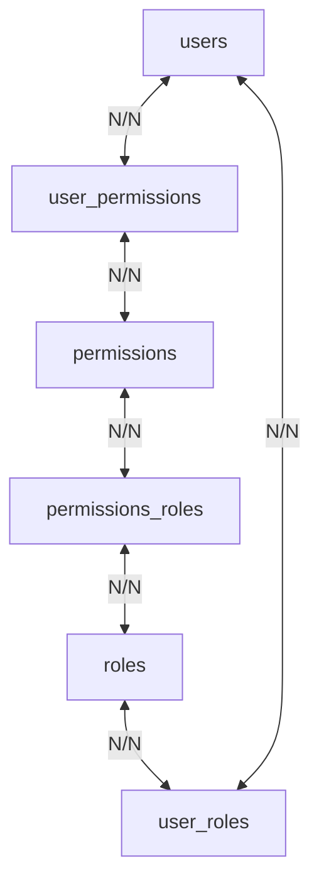

## Tables

### User Roles

| Coluna  | Tipo    | Primary Key |
| ------- | ------- | ----------- |
| id_user | INTEGER | YES         |
| id_role | INTEGER | YES         |

### Users

| Coluna    | Tipo      | Primary Key |
| --------- | --------- | ----------- |
| id_user   | INTEGER   | YES         |
| username  | VARCHAR   | NO          |
| password  | VARCHAR   | NO          |
| create_at | TIMESTAMP | NO          |

### Roles

| Coluna      | Tipo      | Primary Key |
| ----------- | --------- | ----------- |
| id_role     | INTEGER   | YES         |
| name        | VARCHAR   | NO          |
| description | TEXT      | NO          |
| create_at   | TIMESTAMP | NO          |

### Permissions Roles

| Coluna        | Tipo    | Primary Key |
| ------------- | ------- | ----------- |
| id_role       | INTEGER | YES         |
| id_permission | INTEGER | YES         |

### Permissions

| Coluna        | Tipo      | Primary Key |
| ------------- | --------- | ----------- |
| id_permission | INTEGER   | YES         |
| name          | VARCHAR   | NO          |
| description   | TEXT      | NO          |
| create_at     | TIMESTAMP | NO          |

### User Permissions

| Coluna        | Tipo    | Primary Key |
| ------------- | ------- | ----------- |
| id_user       | INTEGER | YES         |
| id_permission | INTEGER | YES         |

### Roles Flow

## Environment variable

Create .env file at the root of the project, these settings are inside it.

- <b>NODE_ENV</b>

  Values: `development, test, production`  
  Example: `NODE_ENV=development`

- <b>API_URL</b>

  Example: `API_URL=http://localhost:8082`

- <b>POSTGRES_USERNAME</b>

  Example: `POSTGRES_USERNAME=postgres`

- <b>POSTGRES_PASSWORD</b>

  Example: `POSTGRES_PASSWORD=postgres`

- <b>POSTGRES_DATABASE</b>

  Example: `POSTGRES_DATABASE=task-manager`

- <b>POSTGRES_HOST</b>

  Example: `POSTGRES_HOST=127.0.0.1`  

- <b>POSTGRES_PORT</b>

  Example: `POSTGRES_PORT=5432`  
