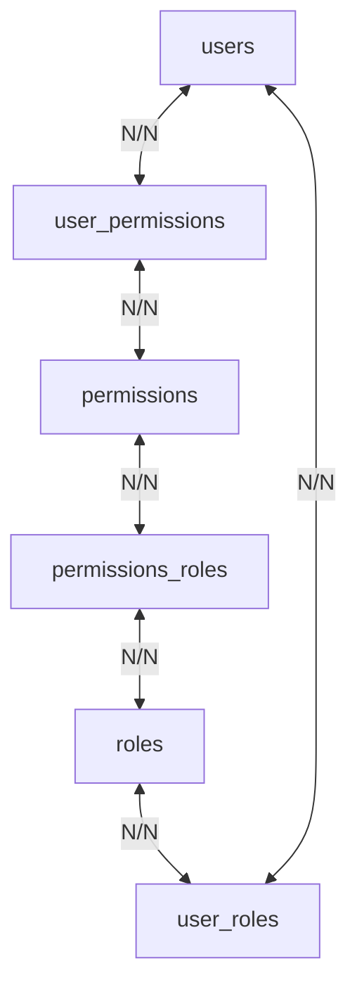
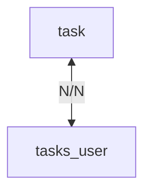

## Tables

### User Roles

| Column  | Type    | Primary Key |
| ------- | ------- | ----------- |
| id_user | INTEGER | YES         |
| id_role | INTEGER | YES         |

### Users

| Column      | Type      | Primary Key |
| ----------- | --------- | ----------- |
| id_user     | INTEGER   | YES         |
| ds_username | VARCHAR   | NO          |
| ds_password | VARCHAR   | NO          |
| dh_create   | TIMESTAMP | NO          |

### Roles

| Column         | Type      | Primary Key |
| -------------- | --------- | ----------- |
| id_role        | INTEGER   | YES         |
| ds_name        | VARCHAR   | NO          |
| ds_description | TEXT      | NO          |
| dh_create      | TIMESTAMP | NO          |

### Permissions Roles

| Column        | Type    | Primary Key |
| ------------- | ------- | ----------- |
| id_role       | INTEGER | YES         |
| id_permission | INTEGER | YES         |

### Permissions

| Column         | Type      | Primary Key |
| -------------- | --------- | ----------- |
| id_permission  | INTEGER   | YES         |
| ds_name        | VARCHAR   | NO          |
| ds_description | TEXT      | NO          |
| dh_create      | TIMESTAMP | NO          |

### User Permissions

| Column        | Type    | Primary Key |
| ------------- | ------- | ----------- |
| id_user       | INTEGER | YES         |
| id_permission | INTEGER | YES         |

### Task

| Column         | Type      | Primary Key |
| -------------- | --------- | ----------- |
| id_task        | INTEGER   | YES         |
| ds_title       | VARCHAR   | NO          |
| ds_description | VARCHAR   | NO          |
| dh_created     | TIMESTAMP | NO          |
| dh_limit       | TIMESTAMP | NO          |
| tp_status      | INTEGER   | NO          |

### Task User

| Column  | Type    | Primary Key |
| ------- | ------- | ----------- |
| id_task | INTEGER | YES         |
| id_user | INTEGER | YES         |

### Task Artefact

| Column      | Type    | Primary Key |
| ----------- | ------- | ----------- |
| id_task     | INTEGER | YES         |
| id_artefact | INTEGER | YES         |
| ds_url      | VARCHAR | NO          |

## Permissions and Roles

### Default Permissions

| Permission  |
| ----------- |
| create_task |
| update_task |
| delete_task |
| delete_user |

### Default Roles

| Role    |
| ------- |
| ADMIN   |
| MANAGER |
| USER    |

### Default Permissions By Role

| Permission  | ADMIN | MANAGER | USER |
| ----------- | ----- | ------- | ---- |
| create_task | T     | T       | T    |
| update_task | T     | T       | T    |
| delete_task | T     | T       | F    |
| delete_user | T     | F       | F    |

`Observation: Only admin and manager can delete tasks of another users.`

## Roles Flow

## Task Flow

## Environment variable

Create .env file at the root of the project, these settings are inside it.

- <b>NODE_ENV</b>

  Values: `development, test, production`  
  Example: `NODE_ENV=development`

- <b>API_URL</b>

  Example: `API_URL=http://localhost:8082`

- <b>POSTGRES_USERNAME</b>

  Example: `POSTGRES_USERNAME=postgres`

- <b>POSTGRES_PASSWORD</b>

  Example: `POSTGRES_PASSWORD=postgres`

- <b>POSTGRES_DATABASE</b>

  Example: `POSTGRES_DATABASE=task-manager`

- <b>POSTGRES_HOST</b>

  Example: `POSTGRES_HOST=127.0.0.1`  

- <b>POSTGRES_PORT</b>

  Example: `POSTGRES_PORT=5432`  

- <b>SECRET_JWT</b>

  Example: `SECRET_JWT=cGFsbWVpcmFzbmFvdGVtbXVuZGlhbA==`  
  Description: value used to sign the user token
